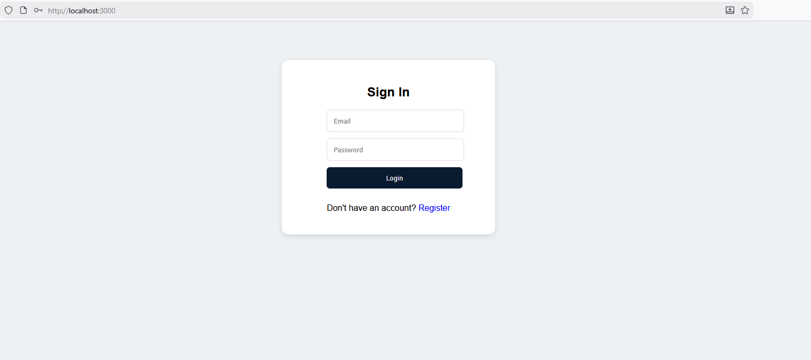
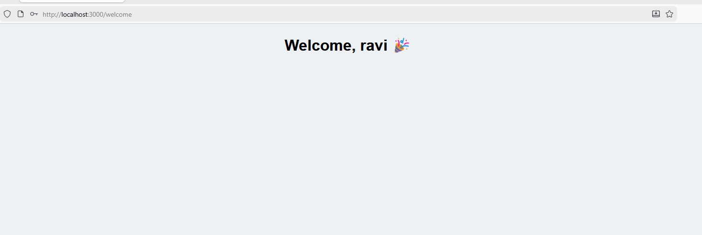

# Full Stack Application (React + Node.js + MySQL)

This project is a full-stack web application built using:

- **React** for the frontend  
- **Node.js + Express** for the backend  
- **MySQL** as the database  

It includes user authentication (Login & Register) and follows a clean folder structure for easy development.

---

## 📁 Project Structure
```bash
frontend/
├── src/
│ ├── components/
│ │ ├── Login.js
│ │ ├── Register.js
│ ├── assets/
│ │ └── images/
│ │ └── example.png
│ └── App.js
├── public/
└── package.json

backend/
├── routes/
│ └── auth.js
├── controllers/
├── config/
│ └── db.js
├── server.js
├── .env
└── package.json
```

---

## 🚀 Frontend (React)
### **How to Run**
```bash
cd frontend
npm install
npm start
```

## 🚀 Backend (Node.js)

### **How to Run**
```bash
cd backend
npm install
npm start
```

## Environment Variables (.env)
```bash
DB_HOST=localhost
DB_USER=root
DB_PASSWORD=yourpassword
DB_NAME=yourdbname
PORT=5000
```

## Database (MySQL)
### Create Table Example
```bash
CREATE TABLE users (
  id INT AUTO_INCREMENT PRIMARY KEY,
  name VARCHAR(255),
  email VARCHAR(255) UNIQUE,
  password VARCHAR(255)
);
```
---

If you'd like, I can also:  
✅ Add a **badge section** (build, license, version)  
✅ Add **API documentation**  
✅ Add **screenshots section** with your real image URLs  


### `npm start`

Runs the app in the development mode.\
Open [http://localhost:3000](http://localhost:3000) to view it in your browser.



### Welcome




Just send me your image links and I will insert them professionally into the README.
